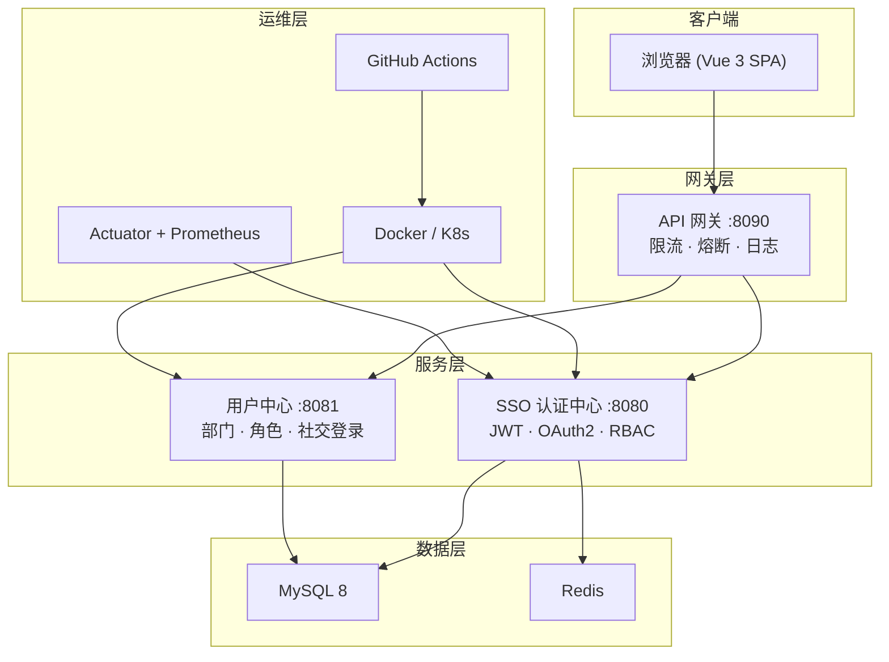

# yunxingcloud

分布式微服务平台 — SSO 认证中心 + 系统管理 + 用户中心 + API 网关

## 技术栈

| 层级 | 技术 |
|------|------|
| 后端 | Java 17 · Spring Boot 4.0 · Spring Security · OAuth2/OIDC · JPA · Quartz · Sentinel |
| 认证 | JWT (JJWT 0.12) · OAuth2 Authorization Server · Nimbus JOSE |
| 数据库 | MySQL 8 (生产) · H2 (开发/测试) · Flyway 版本迁移 |
| 缓存 | Redis + Caffeine · Spring Cache |
| 前端 | Vue 3 · TypeScript · Vite 5 · Pinia · Naive UI 2 · ECharts |
| 文档 | Knife4j 4.5 · Swagger UI · OpenAPI 3 |
| 部署 | Docker · docker-compose · Shell 脚本 · GitHub Actions CI |
| 监控 | Actuator · Prometheus · Sentinel Dashboard · 请求追踪 ID |

## 项目结构

```
yunxingcloud/
├── yunxingcloud-common/       # 共享模块（注解/枚举/工具类）
├── yunxingcloud-core/         # SSO 认证中心 + 系统管理（端口 8080）
├── yunxingcloud-gateway/      # WebFlux API 网关（端口 8090）
├── yunxingcloud-usercenter/   # 用户注册中心（端口 8081）
├── frontend/                  # Vue 3 + Vite SPA
├── deploy.sh                  # 阿里云一键部署脚本
├── backup.sh                  # 数据库定时备份
├── nginx.conf                 # Nginx HTTPS 反向代理模板
├── Dockerfile                 # Docker 镜像
├── docker-compose.yml         # Docker 编排
└── .github/workflows/         # CI/CD
```

## 架构图



## 快速开始

### 一键演示

```bash
./demo.sh
# 自动构建 → 启动 → 冒烟测试 → 打开浏览器
```

### 本地开发

```bash
# 启动后端（H2 内存数据库）
make dev

# 测试账号: admin / admin123

# 前端开发
cd frontend && npm run dev

# 运行全部测试
make test
```

### 使用 Makefile

```bash
make dev              # 启动开发服务器
make test             # 运行全部测试 (28 tests)
make build            # 编译后端 + 构建前端
make package          # Maven 打包
make docker-build     # 构建 Docker 镜像
make docker-up        # Docker Compose 启动
make deploy           # 一键部署到阿里云
```

## API 端点

### SSO 认证中心 (core) — 端口 8080

| 端点 | 方法 | 说明 |
|------|------|------|
| `/api/login` | POST | 用户登录（JWT） |
| `/api/logout` | POST | 登出（Token 黑名单） |
| `/api/refresh` | POST | 刷新 Token |
| `/api/user` | GET | 当前用户信息 + 权限 |
| `/api/menus/tree` | GET | 菜单树 |
| `/api/menus` | GET/POST | 菜单 CRUD |
| `/api/config` | GET/POST | 系统配置 CRUD |
| `/api/job` | GET/POST | 定时任务 CRUD |
| `/api/operlog` | GET | 操作日志（支持筛选） |
| `/api/operlog/export` | GET | CSV 导出 |
| `/api/stats/dashboard` | GET | Dashboard 统计 |
| `/api/system/info` | GET | JVM 系统信息 |
| `/api/system/sessions` | GET | 活跃会话管理 |
| `/api/files/upload` | POST | 文件上传 |
| `/api/health/db` | GET | 数据库健康检查 |
| `/oauth2/authorize` | GET/POST | OAuth2 授权端点 |

### 用户中心 (usercenter) — 端口 8081

| 端点 | 方法 | 说明 |
|------|------|------|
| `/api/users` | GET | 用户列表 |
| `/api/users/import` | POST | CSV 批量导入 |
| `/api/roles` | GET/POST | 角色 CRUD |
| `/api/departments` | GET/POST | 部门树 CRUD |

### 文档地址

- Knife4j: `http://localhost:8080/doc.html`
- Swagger UI: `http://localhost:8080/swagger-ui/index.html`
- Actuator: `http://localhost:8080/actuator/health`

## 安全特性

- **认证**: JWT 双 Token (access 2h + refresh 7d) + 黑名单登出
- **限流**: Sentinel 全链路流控 (QPS) + IP 级别 10次/分钟
- **熔断**: Sentinel 降级 (慢调用/异常比例)
- **锁定**: 5次失败锁定 30 分钟
- **密码**: 8位 + 大写 + 小写 + 数字 + 特殊字符
- **权限**: RBAC (user_roles 多对多) + @PreAuthorize 方法级控制
- **安全头**: XSS/HSTS/X-Frame/Referrer-Policy
- **审计**: Spring Events 异步审计日志

## 部署

### Docker 一键部署

```bash
docker-compose up -d
```

### 阿里云 ECS 部署

```bash
# 1. 首次：修改 deploy.conf 配置
# 2. 初始化服务器
./deploy.sh init
# 3. 一键部署
./deploy.sh full
```

### 生产环境 Checklist

1. 修改所有 `deploy.conf` 中的密码和密钥
2. 配置 Nginx + HTTPS (参考 nginx.conf)
3. 配置 MySQL 数据库
4. 设置 crontab 定时备份: `0 2 * * * /opt/yunxingcloud/backup.sh daily`
5. 启用 systemd 服务: `systemctl enable yunxingcloud`

## 环境变量

| 变量 | 默认值 | 说明 |
|------|--------|------|
| `DB_URL` | `jdbc:mysql://localhost:3306/sso_yunxingcloud` | 数据库连接 |
| `DB_USERNAME` | `root` | 数据库用户 |
| `DB_PASSWORD` | - | 数据库密码 |
| `JWT_SECRET` | (内置默认) | JWT 签名密钥 |
| `OAUTH2_CLIENT_ID` | `test-client` | OAuth2 客户端 ID |
| `OAUTH2_CLIENT_SECRET` | `secret` | OAuth2 客户端密钥 |

## 测试

```bash
# 全部测试
./mvnw test -pl yunxingcloud-core,yunxingcloud-usercenter

# 测试覆盖 (28 tests)
# core: Auth/Menu/Stats/Password (21 tests)
# usercenter: User/Role/Dept (7 tests)
```

## 许可证

MIT
