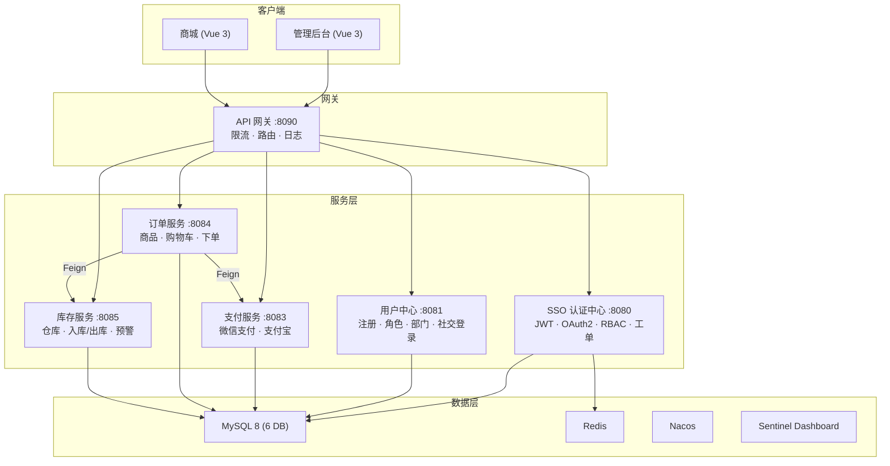

# yunxingcloud

[](https://github.com/xyx11/yunxingcloud/actions)
[](https://github.com/xyx11/yunxingcloud/actions)
[](LICENSE)
[](https://github.com/xyx11/yunxingcloud/releases)
[](https://adoptium.net/)
[](https://spring.io/)

分布式微服务平台 — 6 微服务架构：SSO + 管理 + 网关 + 用户中心 + 支付 + 订单 + 库存

## 技术栈

| 层级 | 技术 |
|------|------|
| 后端 | Java 17 · Spring Boot 4.0 · Spring Cloud Gateway · Spring Security · OAuth2/OIDC · JPA · Feign |
| 认证 | JWT (JJWT 0.12) · OAuth2 Authorization Server · Nimbus JOSE · Sentinel 限流熔断 |
| 数据库 | MySQL 8 (生产) · H2 (开发/测试) · Flyway 版本迁移 |
| 缓存 | Redis + Caffeine · Spring Cache |
| 前端 | Vue 3 · TypeScript · Vite 5 · Pinia · Naive UI 2 · ECharts · PWA |
| 前端商城 | Vue 3 · Vite 5 · Pinia · 响应式布局 · 下拉刷新 |
| 文档 | Knife4j 4.5 · Swagger UI · OpenAPI 3 |
| 部署 | Docker · Docker Compose · Docker Swarm · K8s · systemd · Nginx · Let's Encrypt |
| 监控 | Actuator · Prometheus (8 告警规则) · Sentinel Dashboard · ELK · Zipkin · OpenTelemetry · SSE |

## 项目结构

```
yunxingcloud/
├── yunxingcloud-common/          # 共享模块（注解/枚举/工具类）
├── yunxingcloud-api/             # Feign 接口 + DTO + 降级实现
├── yunxingcloud-core/            # SSO 认证中心 + 系统管理 + 工单 (8080)
├── yunxingcloud-gateway/         # WebFlux API 网关 (8090)
├── yunxingcloud-usercenter/      # 用户注册 + OAuth2/OIDC 授权 (8081)
├── yunxingcloud-payment/         # 支付服务 — 微信/支付宝 (8083)
├── yunxingcloud-order/           # 订单服务 — 商品+购物车+下单 (8084)
├── yunxingcloud-inventory/       # 库存服务 — 仓库+入库/出库+预警 (8085)
├── frontend/                     # Vue 3 管理后台 SPA
├── frontend-mall/                # Vue 3 商城 SPA（移动端适配）
├── deploy.sh                     # 生产一键部署 (12 命令)
├── restart.sh                    # 本地 6 服重启
├── docker-compose.yml            # Docker 9 服务编排
├── docker-compose-swarm.yml      # Docker Swarm 编排
├── k8s/                          # Kubernetes 部署清单
├── nginx.conf                    # Nginx HTTPS 反向代理
├── Makefile                      # 构建/测试/Docker 快捷命令
└── .github/workflows/            # CI/CD
```

## 架构图



## 快速开始

### 一键演示

```bash
./demo.sh
# 自动构建 → 启动 → 冒烟测试 → 打开浏览器
```

### 本地开发

```bash
# 启动全部 6 服务
make dev              # Core (8080)
make dev-usercenter   # Usercenter (8081)
make dev-payment      # Payment (8083)
make dev-order        # Order (8084)
make dev-inventory    # Inventory (8085)
make dev-gateway      # Gateway (8090)

# 前端开发
cd frontend && npm run dev         # 管理后台 :5173
cd frontend-mall && npm run dev    # 商城 :5174

# 默认账号: admin / admin123
```

### 使用 Makefile

```bash
make dev              # 启动 Core 开发服务器
make dev-all          # 启动全部 6 服务
make dev-payment      # 启动 Payment 开发服务器
make test             # 运行全部测试 (243+ tests)
make test-all         # 后端 + 前端全部测试
make lint             # 前后端 ESLint 检查
make type-check       # 前后端 TypeScript 检查
make build            # 编译后端 + 构建前端
make package          # Maven 打包 6 模块
make k6-smoke         # k6 冒烟测试
make k6-load          # k6 负载测试
make docker-up        # Docker Compose 启动
make deploy           # 一键部署
make deploy-quick     # 增量构建快速部署
```

## API 端点

### SSO 认证中心 (core) — 端口 8080

| 端点 | 方法 | 说明 |
|------|------|------|
| `/api/login` | POST | 用户登录（JWT） |
| `/api/logout` | POST | 登出（Token 黑名单） |
| `/api/refresh` | POST | 刷新 Token |
| `/api/user` | GET | 当前用户信息 + 权限 |
| `/api/menus/tree` | GET | 菜单树 |
| `/api/menus` | GET/POST | 菜单 CRUD |
| `/api/config` | GET/POST | 系统配置 CRUD |
| `/api/job` | GET/POST | 定时任务 CRUD |
| `/api/operlog` | GET | 操作日志 |
| `/api/tickets` | GET/POST | 工单 CRUD |
| `/api/stats/dashboard` | GET | Dashboard 统计 |
| `/api/system/info` | GET | JVM 系统信息 |
| `/api/sse/dashboard` | GET | SSE 实时监控流 |
| `/oauth2/authorize` | GET/POST | OAuth2 授权端点 |

### 支付服务 (payment) — 端口 8083

| 端点 | 方法 | 说明 |
|------|------|------|
| `/api/payment/orders` | GET/POST | 支付订单列表/创建 |
| `/api/payment/orders/{id}` | GET | 订单详情 |
| `/api/payment/orders/{id}/pay` | POST | 发起支付 |
| `/api/payment/orders/{id}/refund` | POST | 退款 |
| `/api/payment/callback/{channel}` | POST | 异步支付回调 |

### 订单服务 (order) — 端口 8084

| 端点 | 方法 | 说明 |
|------|------|------|
| `/api/products` | GET/POST | 商品 CRUD |
| `/api/products/hot` | GET | 热门商品 |
| `/api/products/new` | GET | 新品 |
| `/api/products/search` | GET | 全文搜索 |
| `/api/cart` | GET/POST/DELETE | 购物车 |
| `/api/orders` | GET/POST | 订单列表/提交 |
| `/api/orders/{id}/pay` | POST | 发起支付 |
| `/api/categories` | GET/POST | 分类 CRUD |
| `/api/coupons` | GET/POST | 优惠券 |
| `/api/addresses` | GET/POST | 收货地址 |
| `/api/banners` | GET | 首页横幅 |

### 库存服务 (inventory) — 端口 8085

| 端点 | 方法 | 说明 |
|------|------|------|
| `/api/warehouses` | GET/POST | 仓库 CRUD |
| `/api/inventory` | GET | 库存列表 |
| `/api/inventory/stock-in` | POST | 入库 |
| `/api/inventory/stock-out` | POST | 出库 |
| `/api/inventory/alerts` | GET | 低库存预警 |
| `/api/inventory/alerts/stream` | GET | SSE 实时预警流 |

### 文档地址

- Knife4j: `http://localhost:8080/doc.html`
- Swagger: `http://localhost:8080/swagger-ui/index.html`
- Prometheus: `http://localhost:8080/actuator/prometheus`

## 安全特性

- **认证**: JWT 双 Token (access 2h + refresh 7d) + 黑名单登出
- **限流**: Sentinel 全链路流控 + Nacos 动态规则 + IP 级别限流 + 用户级 @UserRateLimit
- **熔断**: Sentinel 降级 + Feign Fallback 服务间降级
- **幂等**: @Idempotent 注解 (Redis SETNX) 防重复下单
- **锁**: Redisson 分布式锁防库存超卖
- **锁定**: 5次失败锁定 30 分钟
- **密码**: 8位 + 大写 + 小写 + 数字 + 特殊字符 + TOTP 2FA
- **权限**: RBAC + @PreAuthorize + @DataScope 数据权限
- **安全头**: CSP + HSTS + X-Frame + Referrer-Policy + Permissions-Policy
- **审计**: Spring Events 异步审计 + AuditTrail

## 部署

### Docker Compose

```bash
docker-compose up -d  # 9 服务：Nacos + Sentinel + MySQL + Redis + 5 应用服务

# 带监控栈
docker-compose -f docker-compose.yml -f docker-compose-monitoring.yml up -d
# + Prometheus :9090 + Grafana :3000 (admin/admin)
```

### Docker Swarm

```bash
docker stack deploy -c docker-compose-swarm.yml yunxingcloud
```

### Kubernetes

```bash
kubectl apply -k k8s/
```

### 阿里云 ECS

```bash
./deploy.sh init      # 初始化服务器环境
./deploy.sh full      # 构建→上传→启动→健康检查
./deploy.sh quick     # 增量构建快速部署
./deploy.sh restart   # 重启全部 6 服务
./deploy.sh status    # 服务状态
```

### 生产 Checklist

1. 修改 `deploy.conf` 中所有密码和密钥
2. 配置 Nginx + HTTPS (参考 `nginx.conf`)
3. 配置 MySQL 数据库（每服务独立 DB）
4. 填入支付商户凭证到 `payment.application.yaml`（可选，默认 mock）
5. 设置 crontab 定时备份: `0 2 * * * /opt/yunxingcloud/backup.sh`
6. 启用 systemd: `systemctl enable yunxingcloud-{core,gateway,usercenter,payment,order,inventory}`

## 环境变量

| 变量 | 默认值 | 说明 |
|------|--------|------|
| `DB_URL` | `jdbc:mysql://localhost:3306/yunxingcloud_core` | 数据库连接 |
| `DB_USERNAME` | `root` | 数据库用户 |
| `DB_PASSWORD` | - | 数据库密码 |
| `JWT_SECRET` | (内置) | JWT 签名密钥 |
| `NACOS_SERVER` | `127.0.0.1:8848` | Nacos 注册中心 |
| `REDIS_HOST` | `redis` | Redis 地址 |
| `SENTINEL_DASHBOARD` | `127.0.0.1:8082` | Sentinel 控制台 |

## 测试

```bash
# 全部测试 (257 tests)
make test-all

# 后端按服务 (243 tests)
make test-core         # 99 tests
make test-usercenter   # 29 tests
make test-gateway      # 1 test
make test-payment      # 6 tests
make test-order        # 57 tests
make test-inventory    # 8 tests

# 前端 (14 tests)
make test-frontend     # Admin 6 tests
make test-mall         # Mall 8 tests

# E2E (Playwright)
cd frontend && npx playwright test
```

## 许可证

MIT